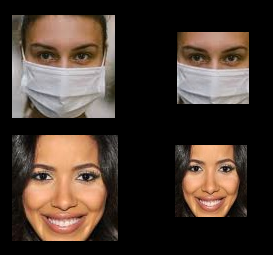

# Data set de rostros con y sin mascarillas
Este dataset fue construido tomando imágenes de https://www.kaggle.com/ashishjangra27/face-mask-12k-images-dataset?select=Face+Mask+Dataset

VIDEO TUTORIAL (YOUTUBE) PARA LA DETECCIÓN DE PERSONAS QUE LLEVAN MASCARILLAS O NO: https://youtu.be/_SCD62HmJwA

En Dataset_faces existen dos directorios: Con_mascarilla y Sin_mascarilla. Cada uno de estos posee 385 imágenes a color de rostros con mascarilla y sin mascarilla respectivamente.
Cada una de ellas posee 72 pixeles de alto y ancho.

## ¿Cómo se obtuvieron estas imágenes?
En un principio las imágenes fueron obtenidas de la fuente anteriormente mencionada, luego se volvió a aplicar detección facial con MediaPipe face detection.
Una vez ubicado el rostro en la imagen se procedió a recortar esta área y se la redimensionó a 72x72 pixeles.

Una vez que se obtuvieron todas las detecciones, se fueron analizando las imágenes obtenidas con el objetivo de descartar detecciones erróneas.

En esta imagen podemos ver un ejemplo de las imágenes de entrada (izquierda) y las imágenes resultantes (derecha).
